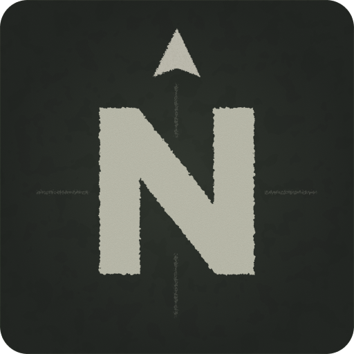

<div align="center">
  
</div>

## Northstar 是一款为 Escape from Tarkov 打造的现代化桌面工具

目前塔科夫玩家常常需要在多个网页、Wiki、地图网站来回切换，查找任务路线、物品用途、钥匙位置以及地图信息

Northstar 希望将这些零散的信息集中到一个统一的平台中，让玩家能够专注于游戏本身，而不是在浏览器标签页之间反复切换

## 功能

| 功能    | 大致介绍                                                                                                                                    | 状态  |
|:-----:|:---------------------------------------------------------------------------------------------------------------------------------------:| --- |
| 任务导航  | 以类似思维导图的形式列出所有支线任务，选择某个任务可显示相关内容（如对应商人、必要性、解锁条件、踩点位置、钥匙获取方式及价格、任务道具获取方式及价格、任务要求、相关视频），可以根据游戏设置完成进度，统计任务完成状态，指引任务路线（如仙女棒解锁路线、3x4保险箱解锁路线） | ⛔️  |
| 地图    | 地图，可以显示物资点、玩家刷新点、地点名称&俗称、撤离点、甚至玩家当前所处位置（如果可能的话）。支持从其他功能区跳转（例如在任务导航中选择一个任务，点击"在地图中指出"，就会自动跳转到地图然后标出任务点）                                  | ⛔️  |
| 跳蚤市场  | 捡到某个物品不知道价格？直接在搜索框输入物品名称（支持模糊搜索）就可以查到：商人报价，市场价格，商人&市场比价，市场报价数量，更新时间                                                                     | ⛔️  |
| 代办    | 我觉得做一个代办功能来理清思路是很有必要的。代办可以分为四种：1.纯文字（例如提醒自己别忘了踩点）2.带图标和进度条的物品收集提醒（可以提前列好藏身处需要的物品）3.步骤表（进图前列好自己每一步该干什么）4.进度条（比如消灭20个scav，耶格的兵必备）         | ⛔️  |
| 智能搜索框 | 我希望这玩意可以做任何事情，输入任何东西，自己跳转<br/>子弹->属性<br/>物品->价格<br/>任务->导航<br/>以及其他乱七八糟的                                                                | ⛔️  |

## 技术栈

* Electron
* Vue 3
* TypeScript
* Vite
* Naive UI
* UnoCSS

## 开发状态

当前版本：v0.1.0

项目仍处于早期开发阶段，功能与界面设计可能随时发生变化。

## 开源协议

MIT License

## 开发

### 下载

```bash
$ npm install
```

### 测试

```bash
$ npm run dev
```

### 构建

```bash
# For windows
$ npm run build:win

# For macOS
$ npm run build:mac

# For Linux
$ npm run build:linux
```
